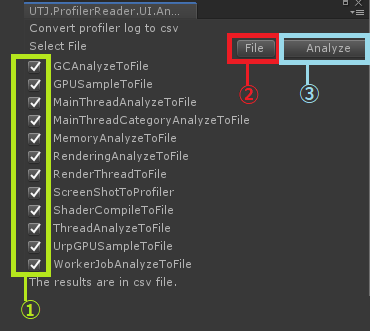

# ProfilerReader
Tools for analyze profiler log data. 
Read this in other languages: English, [日本語](README.ja.md) 

## Summary
With this tool, you can analyze the binary log of "Unity Profiler".
For example, generate csv files that shows Samples allocating many Managed Heap from "Unity Profiler" binary log.

## Avalable versions
2019.4 / 2020.3/2021.1/2021.2/2021.3/2022.2/2022.3
 2022.1 skip

## Filter Search
Call "Tools->UTJ->ProfilerReader->AnalyzeToCsv" and then this window will be displayed. 

 
1.Set Profiler log file. 
2.Set Conditions to search samples. 
3.Execute Analyze 
4.The results are here 
5.Write the results to csv file. 

## CSV Feature
### GUI
Call "Tools->UTJ->ProfilerReader->AnalyzeToCsv" and then this window will be displayed. 

 
This tool generate summarized csv files. 
1.Select the categories to generate csv files. 
2.Set Profler log File. 
3.Execute Analyze 

### CUI Sample
Unity.exe -batchMode -projectPath "ProjectPath" -logFile .\Editor.log -executeMethod UTJ.ProfilerReader.CUIInterface.ProfilerToCsv -PH.inputFile "Binary logFile(.data/.raw)" -PH.timeout 2400 -PH.log

And some csv file will be generated at subfolder for binary data.

## CSV Files:
This tool generate csv files with footer name. 
These are samples. 

 -"xxx_mainThread_frame.csv" 
The CPU stats by category in each fraemes.
 
 -"xxx_gc_result.csv" 
The list that shows "GC.Alloc".
 
 -"xxx_gc_detail.csv" 
The list of "GC.Alloc" and with Callstackinfo.
 
 -"xxx_gpu_sample.csv" 
The list about GPU status in each frames .
 
 -"xxx_main_self.csv" 
The list about CPU Samples.
 
 -"xxx_memory.csv" 
The list about Memory status in each frames .
 
 -"xxx_rendering.csv" 
The list about Rendering status in each frames .
 
 -"xxx_renderthread.csv" 
The list about RenderThread status in each frames .
 
 -"xxx_result.csv" 
The list about threads status in each frames .
 
 -"xxx_shader_compile.csv" 
The list that shows Shader Compiling.
 
 -"xxx_urp_gpu_sample.csv" 
The list about GPU for Universal RP.
 
 -"xxx_worker.csv" 
The list about workerThread status.
 
 - "xxx_jitInfos.csv" 
The list of callstack symbol infos.( should enable "Profiler.enableAllocationCallstacks").
 
